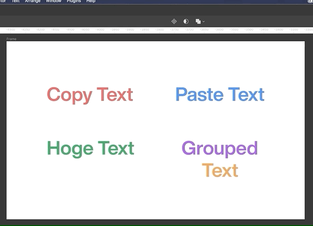

# Figma Plugin - Copy and Paste Text(s)
Figma plugin to copy &amp; paste only text from selected layers.

# Usage
## Copy Text
Select the Text Objects you want to copy and run `Copy Text`.
And then copied texts to clipboard.
(Not support selected range of text)

## Paste Text
Select the Text Objects you want to paste and run `Paste Text`
If you want to paste in cursor position, you should run default paste (⌘V) with unformmated text (you will get it with `Copy Text` plugin command !!).

# Demo
## Copy and Paste

## Copy multi selected texts and Paste

## Copy and Paste to group texts

# Supported Object
- Text
- Group
- Frame
- Component
- Instance